[Link to the Jupyter Notebook](https://github.com/Shashidhar-Sathya/crop_diseases/blob/master/crop_diseases_ead.ipynb/)
# Disease Detection in Field Crops and Plantations 
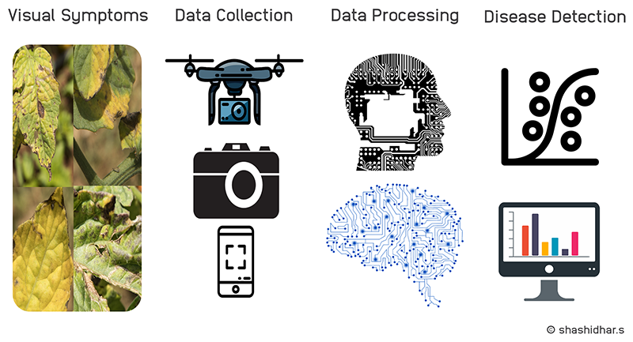

## Author
### Shashidhar Sathyanarayan 

## Executive Summary
Agriculture is the backbone of the global economy and the primary source of livelihood for billions of people worldwide. 
Annually, global crop yields suffer losses of **25%-30%** on average due to viral, bacterial, fungal infections, and other plant diseases, with certain staple crops like Maize, Rice, and nutritious fruit like Banana, experiencing high rates of loss. According to USDA NIFA report (dated February 6, 2023) the loss is even higher at **20%-40%** and cost global economy a huge ***$220 billion***.

This substantial crop loss, compounded by varying agro-climatic conditions and a growing global population, presents a critical challenge to food security worldwide and often causing malnutrition among the young, skyrocketing inflation and large-scale social disturbances.

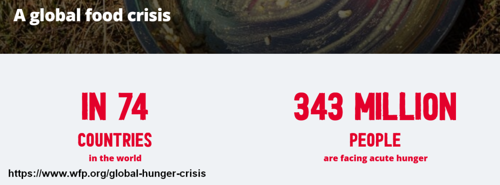

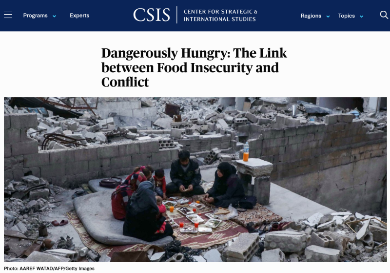

All stakeholders, from universities and research institutes developing disease-resistant crop varieties to agricultural enterprises implementing innovative disease and pest management strategies and technology companies creating advanced infrastructure & tools, are working to mitigate the situation.

These collaborative efforts are being significantly aided by advancements in cutting-edge technology, especially in the last few years, which have enabled farming communities to become more technologically adept and leverage data-driven insights to combat diseases affecting their crops.

--- 
## Rationale

Before we embark on trying to address the impact of crop diseases, let us take a look at two crops that being considered in this Project.

### 1. Banana
Bananas are the world's most popular fruit and are grown in more than `150 countries`. They are a staple food for millions of people in developing countries and the fourth most important food crop in the world. Bananas are grown in tropical and subtropical regions of Africa, Asia, and Latin America. Bananas are susceptible to a number of diseases, including Fusarium wilt, black sigatoka, among others. These diseases can cause significant losses in yield and quality and can threaten the livelihoods of farmers who depend on bananas for their income, and general population who depend on it for nutritional values.

### 2. Maize 
Maize is one of the most important cereal crops in the world and is grown in more than 170 countries. It is a staple food for millions of people in both `developing` and `developed` countries and is also used as feed for livestock. Maize is susceptible to a number of diseases, including maize lethal necrosis and maize streak virus. These diseases can cause significant losses in yield and quality and can threaten the livelihoods of farmers who depend on maize for their income, and general population who depend on it for nutritional values.

### Research Question 
The objective is to build a Deep Learning `Image Classifier` model(s) using Neural Networks, that can be used to look for early signs of a crop diseases and provide preventive or/and corrective action recommendations.  By addressing the crop diseases early, the farming community can reduce the impact of the diseases and improve the yield and quality of the crops.

1. The `Banana` model should be able to identify the disease as one of "Black Sigatoka" or "Fusariam Wilt" or "Healthy" (*with Severity of High or Low*)
2. The `Maize` model should be able to identify the disease as one of "Maize Lethal Necrosis" or "Maize Streak Virus " or "Healthy" (*with Severity of High or Low*)

### Data Understanding, What are the benefits of this project?
Let us take a look at some of global Market Financial and Crop Yield data to understand the gravity of the situation.
#### Banana
As seen here the `Top 15` countries produce nearly 1 Billion Tonnes of Banana annually, and have **Total Gross Production Value** of **50 Billion US$.** So there is `BIG` incentive for reducing crop losses

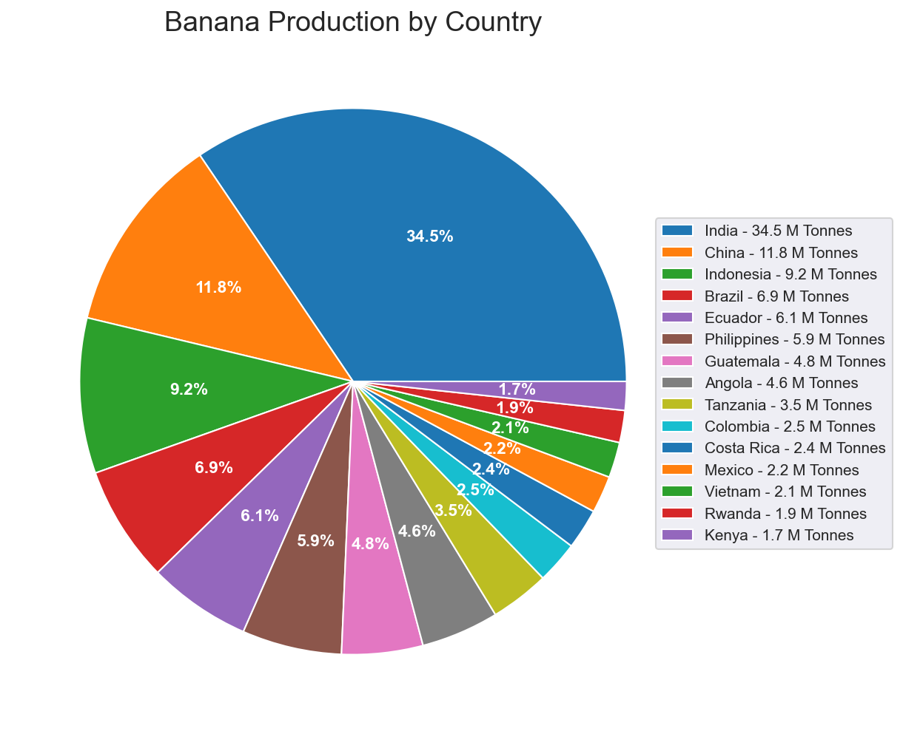

India being largest producer of Banana,primarily grows for internal consumption. Many other countries grow Banana for exporting to North America and Europe.

---
The Gross Production Value of Banana in the `Top 15` countries is nearly **50 Billion US$**. This is a huge market and any reduction in crop losses can have a significant impact on the economy.

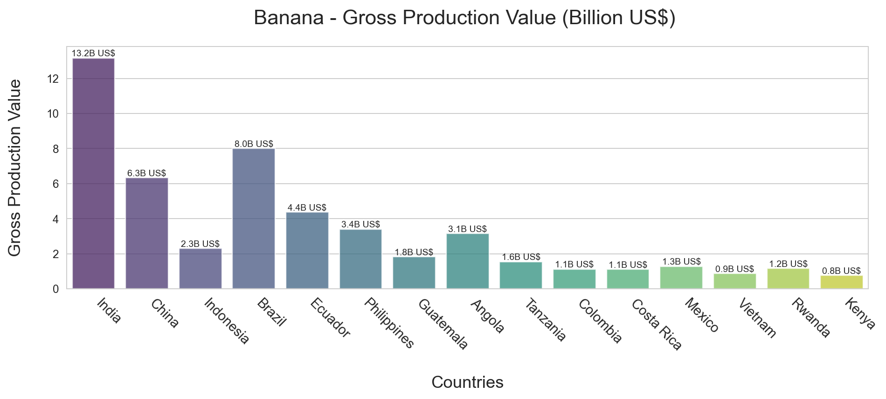

---
The crop losses among these Top 15 countries is **26%** on average. 

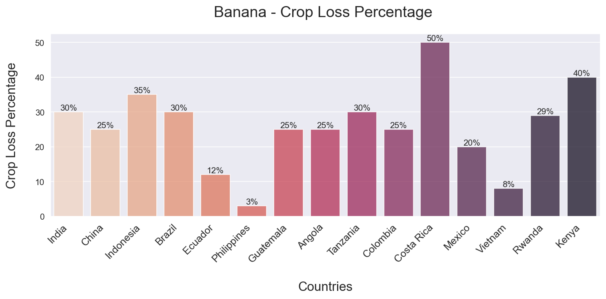
This is a significant loss and any reduction in crop losses can have a significant impact on the economy. A notable exception to this is `Phillipines` which has a very low Banana crop loss percentage of just `3%`.

---
#### Maize
We can again see the `Top 15` countries produce nearly 1 Billion Tonnes of Maize annually, and have **Total Gross Production Value** of **272 Billion US$.** So again there is `BIG` incentive for reducing crop losses

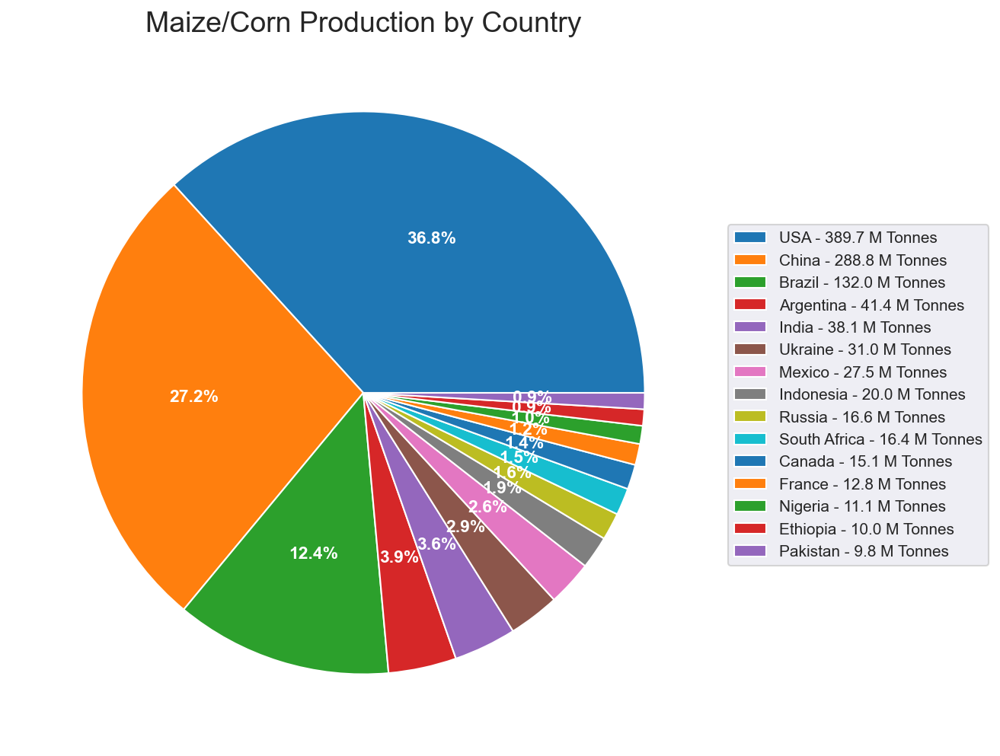

USA dominates the ranking by producing nearly 390 million tonnes, followed by China, Brazil. Other countries produce substantially less. Interestingly, In 2023 & 2024, Brazil surpassed USA in Exports even though it produces only 3rd of what US produces reaching US$ 14.4 in earnings

---
The Gross Production Value of Maize in the `Top 15` countries is nearly **272 Billion US$**. This is a huge market and any reduction in crop losses can have a significant impact on the economy.

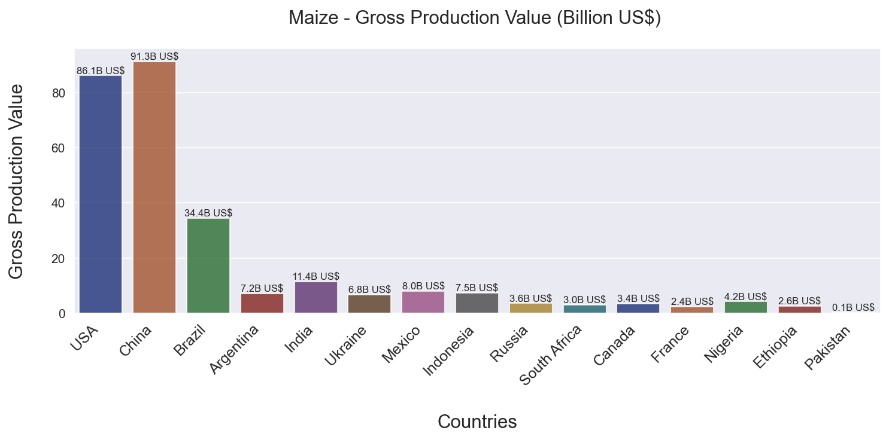
 USA is the highest producer of Corn, followed by China, Brazil and other countries. Corn is predominantly used for generating oil, sugar, animal feed among others Interestingly, China's Gross Production Value is higher than USA due to better price advantage. Brazil has overtaken US as `World's Largest Exporter` of corn.

---
Below plot shows the devastating effect the `Crop Loss` is having on `food security` concerns World over.Ranging from `10%` in Brazil to huge `60%` in Pakistan.  

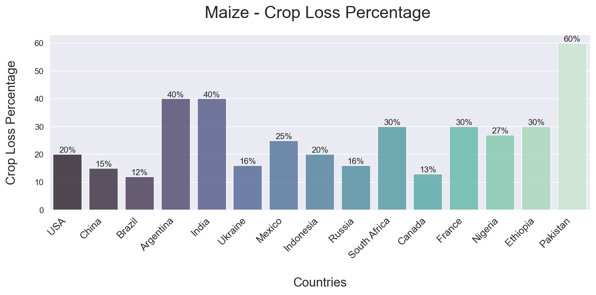
It is in everyone's interest to reduce the crop losses and improve the farm output globally. This can have a significant impact on the economy and food security.

---
### What Diseases are we looking at?
### 1. Banana :In Banana, we are looking at two diseases
1. **Disease 1 - Fusarium Wilt :**

Bananas are mainly grown in Asia, Africa and Latin America.  India is the ***largest*** grower of Bananas, however most of the output is for domestic consumption.  Africa and Latin America predominantly grow Bananas for export.   
Fusarium Wilt is fungal disease that affects many crops like Banana, Tomato, Cucumbers, Melons among others. In case of Banana, it is also popularly known as *Panama Wilt*. It is named as such because they were observed in Panama and Costa Rica in early 20th century.  Currently it has spread across the world barring few countries. As of 2021, there were no commercially available varieties resistant to this infection.  Visually surveillance and disease management is the only option that is being employed. Hence detecting this outbreak is very important.

2. **Disease 2 - Black Sigatoka :**

Black Sigatoka is "leaf spot disease" that affects the leaves of Banana plant. This is caused by the fungus *Pseudocercospora fijinesis* They are widely prevalent across all Banana growing regions.  Early leaf symptoms are tiny reddish-rusty brown flecks that are most evident on the underside of leaves. They gradually increase in size and turn dark-brown or black.  Large areas of infection can affect the leaf to collapse.  
    
*Both of the above disease compromise the fruit size, quality, shelf life and yield.  Sometimes the loss can be between 30-50%.*

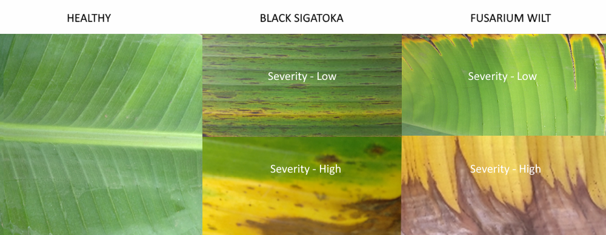
    
    

### 2. Maize
1. **Disease 1 - Maize Lethal Necrosis (MLN):**

Maize Lethal Necrosis or MLN is caused by synergistic mixed infection with any of several maize-infecting viruses Maize Chlorotic Mottle virus (MCMV). Leaves of infected plants become yellow from the tip and margins to the centre. Older leaves (bottom of plant) remain green. Ears and leaves dry up and sometimes look like a mature plant. The whole plant dies and maize cobs remain without kernels often resulting in 90-100% loss of yield.

2. **Disease 2 - Maize Streak Virus (MSV):**

Maize streak virus (MSV) occurs throughout Africa, Central America, Australia where it causes what is probably the most serious viral crop disease on the continent It is tranmitted by *leafhopper*. Symptoms usually are round spots to begin with and as the infection increases, they turn into continuous streaks. This is known contributor to food security in Africa south of Sahara.

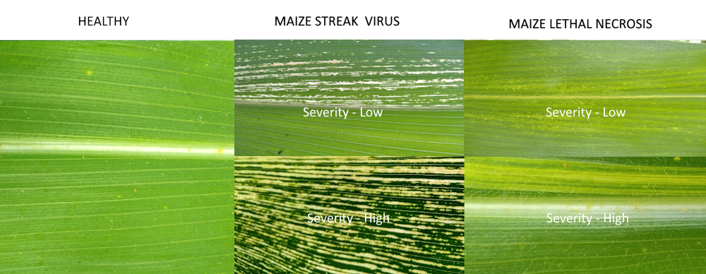

---

### Challenges of a Single Model for ALL crop diseases:
1. Visual Differences: Different crops have very different physical characteristics (leaf shape, plant structure, growth patterns). Diseases manifest differently on different plants. For example, a disease that causes leaf spots on a tomato plant might cause wilting or stalk rot in corn. These visual differences can make it difficult for a single model to learn features that are universally applicable.

2. Feature Conflicts: The model might struggle to identify the features correctly and may predict incorrectly
 
3. Data Distribution: Number of images of a given crop may be different and the model may get biased.

### Optimal Approach
To keep out influence of other crops out of any single crop, better approach would be to build **Crop-specific** model.  
This has several advantages:
1. Relevant : Farmers only need a model that's relevant to their crop. There's no need to clutter their interface with disease detection for other plants. Simplifies user experience
2. Performance Optimization : The crop-specific models can be optimized by additional training and fine tuning
3. Maintainability : Managing separate models can be easier in the long run. If a new disease emerges for one crop, you can update the corresponding model without affecting the other models.
4. Deployment Efficiency: Deploying smaller, crop-specific models can be more efficient in terms of computational resources and deployment complexity compared to a single, large, multi-crop model.

--- 
##### Dataset Sources:

<table>
<tr><td colspan=2 ><h3>Banana</h3></td><tr>
<td>Year:2022</td><td>The Nelson Mandela African Institution of Science and Technology Bananas Dataset</td></tr>
<tr><td>Authors</td><td>Mduma, Neema; Laizer, Hudson; Loyani, Loyani; Macheli, Mbwana; Msengi, Zablon; Karama, Alice; Msaki, Irine; Sanga, Sophia; Jomanga, Kennedy; Judith, Leo</td></tr>
<tr><td>Link</td><td><a href="https://doi.org/10.7910/DVN/LQUWXW">Bananas Dataset-https://doi.org/10.7910/DVN/LQUWXW, Harvard Dataverse, V6 </a></td></tr>
</table>
<table>
<tr><td colspan=2 ><h3>Maize</h3></td><tr>
<td>Year:2022</td><td>The Nelson Mandela African Institution of Science and Technology Maize Dataset</td></tr>
<tr><td>Authors</td><td>Mduma, Neema; Laizer, Hudson; Loyani, Loyani; Macheli, Mbwana; Msengi, Zablon; Karama, Alice; Msaki, Irine; Sanga, Sophia; Jomanga, Kennedy</td></tr>
<tr><td>Link</td><td><a href="https://doi.org/10.7910/DVN/GDON8Q"> Maize Dataset-https://doi.org/10.7910/DVN/GDON8Q, Harvard Dataverse, V6</a></td></tr>
</table>

**Number of Images - Banana**
1. Black Sigatoka - 2696 images (2019 - High Severity, 677 - Low Severity)
2. Fusariam Wilt - 2500 images (1566 - High Severity, 934 - Low Severity)
3. Healthy       - 2860 images 

**Number of Images - Maize**
1. Maize Lethal Necrosis - 2076 images (1734 - High Severity, 342 - Low Severity)
2. Maize Streak Viru - 2008 images (1687 - High Severity, 321 - Low Severity)
3. Healthy       - 2043 images

---

## Sample Image of a Diseased crop
|Crop| Sample Image  | Histogram   | Distribuition   |
|--- |---|---|---|
|Banana|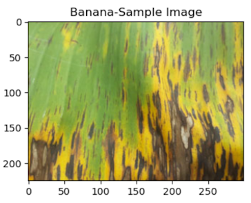|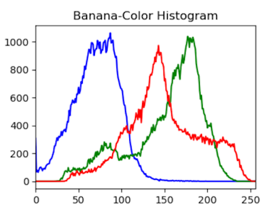|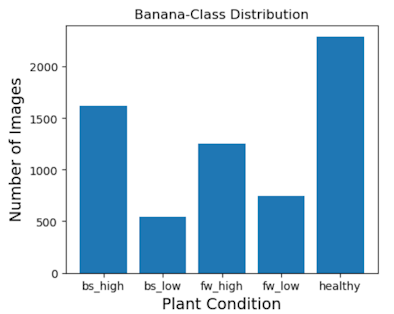|
|Maize|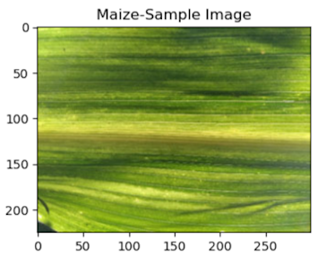|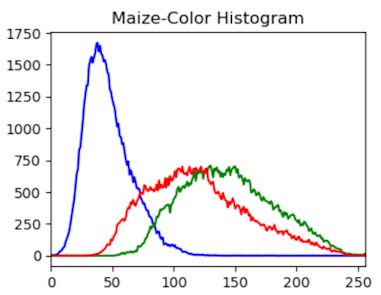|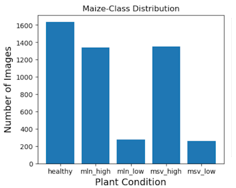|

---

## Visualization of Healthy and Diseased Plant Images

### Sample Images of Banana
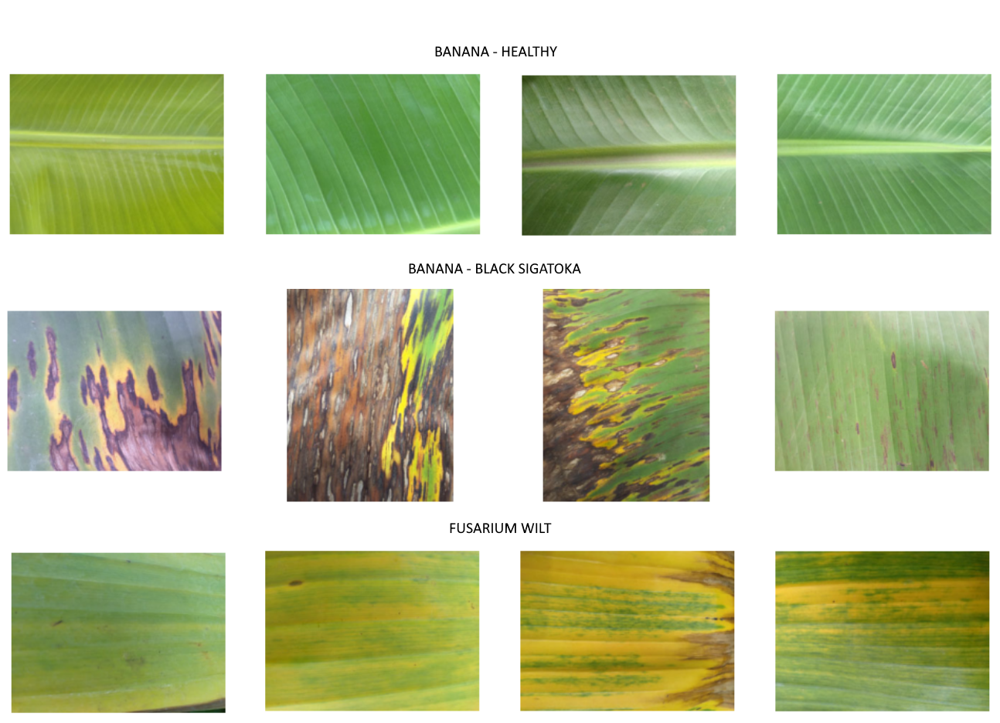

---
### Sample Images of Maize
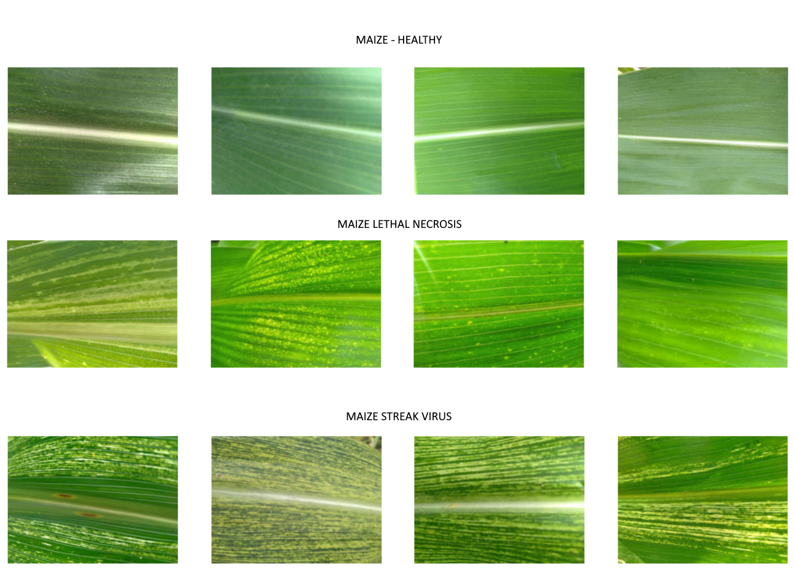

---

## Modeling Methodology
The approach to building the models will be as follows:
1. Categorize the images of healthy and diseased images
2. Preprocess the images using tools external tools like Adobe Photoshop 
3. Split the images into Training and Validation sets
4. Build a Sequential Simple Neural Network model as Baseline, using TensorFlow and Keras
5. Train the model on the training set and evaluate it on the validation set
6. Using this baseline model as reference, use MobileNetV2 model for Transfer Learning
7. When using MobileNetV2 model, implement 5 Fold cross validation using StratifiedKFold CV
8. Train the model and evaluate it on the validation set
9. Evaluate the model using metrics like Accuracy, Precision, Recall, F1-score, confusion matrix, especially false positives/negatives
10. Visualize the Learning curves (loss/accuracy vs. epochs), confusion matrix heatmap – valuable for understanding model behavior and areas for improvement.
11. Using the best model of the 5 Fold CV, build the final model using the entire training set and evaluate the model and its performance on the validation set consisting of unseen diseased images.

## Baseline Model: Simple Neural Network
Banana Model and Maize Model were built using :
1. Sequential Model
2. 3 Convolutional Layers
3. 3 MaxPooling Layers
4. 1 Flatten Layer
5. 2 Dropout Layers
6. 1 Dense Layers
7. 1 Output Layer

The `Training`images were applied with following transformations:
1. Rescale
2. Resize (150,150)
3. Batch Size (32)  
4. rotation_range=45
5. width_shift_range=0.2
6. height_shift_range=0.2
7. shear_range=0.2
8. zoom_range=0.3
9. horizontal_flip=True
10. class_mode='categorical'

The `Validation` images were applied with following transformations:
1. Rescale
No other transformations were applied

The model was trained for 30 epochs with a batch size of 32. The model was evaluated on the validation set and the performance metrics were calculated.

### Evaluation of Baseline Models
#### Banana Model Metrics
<table>
<tr><td>Metrics</td><td>Training Average</td><td>Validation Average</td></tr>
<tr><td>Loss</td><td>38.6%</td><td>58.5%</td></tr>
<tr><td>Accuracy</td><td>83.1%</td><td>78.9%</td></tr> 
<tr><td>Precision (precision_1)</td><td>88.2%</td><td>81.2%</td></tr>
<tr><td>Recall (recall_1)</td><td>80.3%</td><td>74.3%</td></tr>
<tr><td>F1 Score</td><td>84.1%</td><td>77.6%</td></tr>
</table>

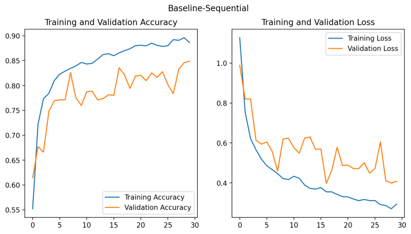

The Banana model was tested with unseen 50 images. The model was able to predict the disease with an accuracy of 81%. 9 images were classified incorrectly

--- 
#### Maize Model Metrics
<table>
<tr><td>Metrics</td><td>Training Average</td><td>Validation Average</td></tr>
<tr><td>Loss</td><td>52.0%</td><td>53.8%</td></tr>
<tr><td>Accuracy</td><td>78.4%</td><td>79.3%</td></tr>
<tr><td>Precision (precision_1)</td><td>84.6%</td><td>83.5%</td></tr>
<tr><td>Recall (recall_1)</td><td>76.0%</td><td>79.4%</td></tr>
<tr><td>F1 Score</td><td>80.1%</td><td>81.4%</td></tr>
</table>

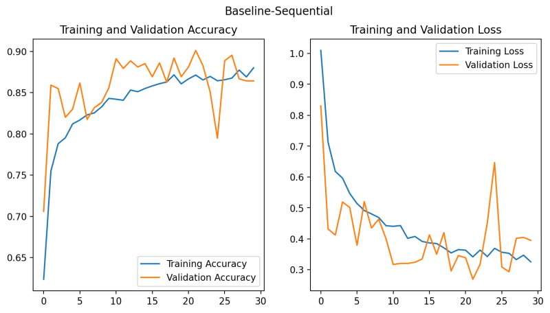

Maize model was tested with unseen 50 images. The model was able to predict the disease with an accuracy of 76%. 12 images were classified incorrectly

---
### Evaluation of MobileNetV2 Models with K Fold Cross Validation (K=5)
The MobileNetV2 model was used for Transfer Learning. The models were trained using 5 Fold Cross Validation. The models were also trained for 20 epochs with a batch size of 32. The models were then evaluated on the validation set and the performance metrics were calculated. 

#### Banana Model Metrics
<table>
<tr><td>Metrics</td><td>Training Average</td><td>Validation Average</td></tr>
<tr><td>Loss</td><td>28.9%</td><td>29.6%</td></tr>
<tr><td>Accuracy</td><td>88.3%</td><td>88.7%</td></tr>
<tr><td>Precision (precision_1)</td><td>89.9%</td><td>89.8%</td></tr>
<tr><td>Recall (recall_1)</td><td>85.5%</td><td>87.7%</td></tr>
<tr><td>F1 Score</td><td>87.6%</td><td>88.7%</td></tr> 
</table>

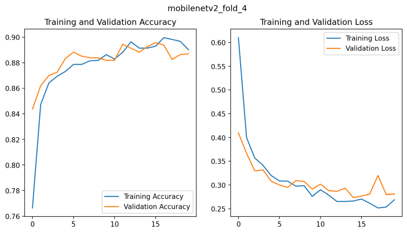

---

The confusion matrix for the Banana model is shown below. We can see that there are few incorrect classifications.  This is due to similarities disease symptoms and the model is unable to differentiate between them.  ***Perhaps more data and more training can help in improving the model.***

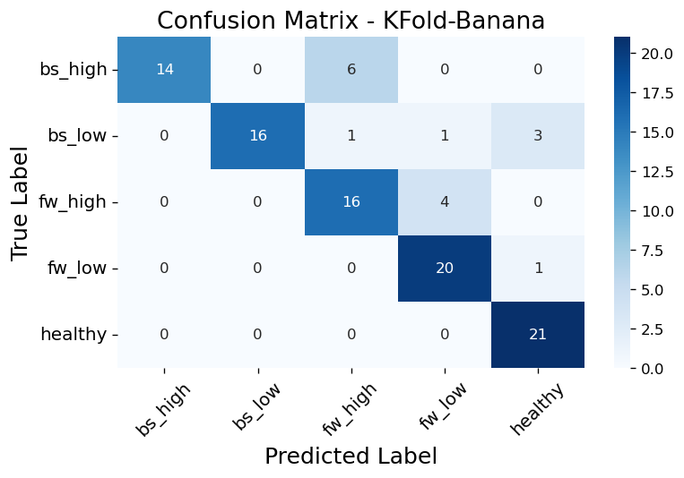

---
#### Maize Model Metrics 

<table>
<tr><td>Metrics</td><td>Training Average</td><td>Validation Average</td></tr>   
<tr><td>Loss</td><td>28.6%</td><td>31.0%</td></tr>
<tr><td>Accuracy</td><td>88.7%</td><td>87.8%</td></tr>
<tr><td>Precision (precision_1)</td><td>90.9%</td><td>90.1%</td></tr>
<tr><td>Recall (recall_1)</td><td>86.4%</td><td>85.5%</td></tr>
<tr><td>F1 Score</td><td>88.6%</td><td>87.7%</td></tr> 
</table>

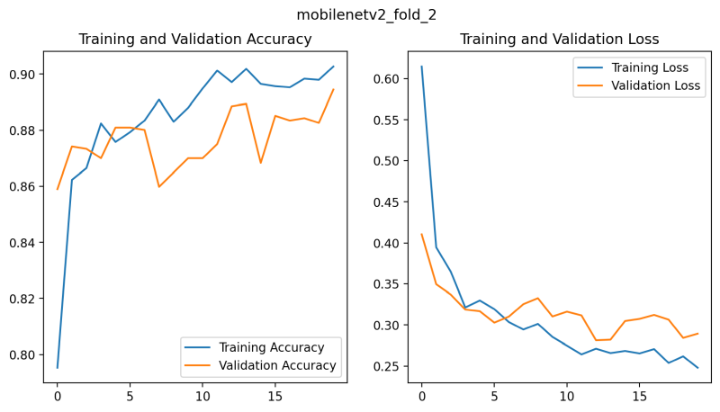

---

The confusion matrix for the Maize model is shown below. 
Here We can see that there are few incorrect classifications, both False Negatives & False Positives.  Again, this is due to similarities disease symptoms and the model is unable to differentiate between them. Specifically with `LOW SEVERITY` infection levels    ***Perhaps more data and more training can help in improving the model.***

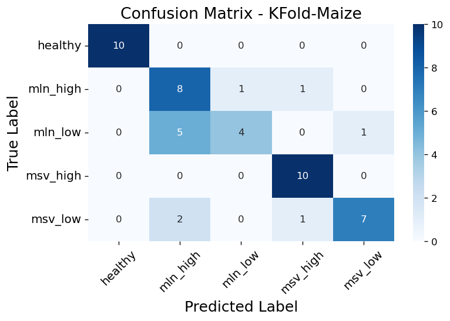

---

# The Final Fully Trained Model
The best model from the 5 Fold Cross Validation was used to train the final model using the entire training set. The model was then evaluated on the validation set consisting of unseen diseased images. The performance metrics were calculated.
Here are the metrics for the final models:
### Banana Model Metrics:

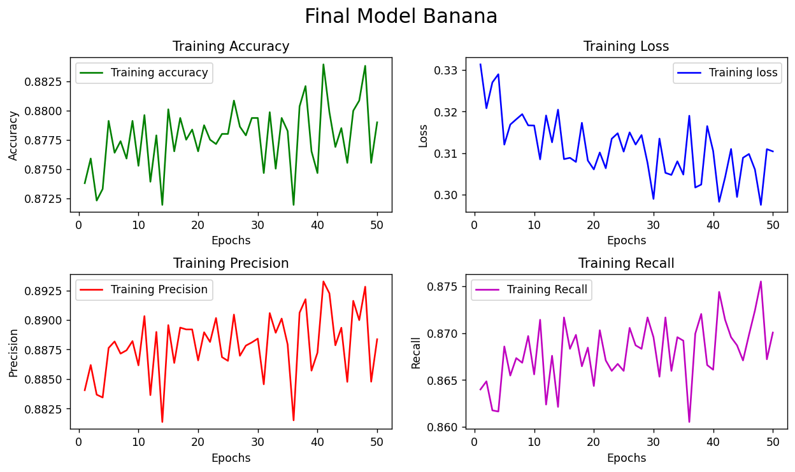

#### Banana Model Metrics 

<table>
<tr><td>Metrics</td><td>Training Average</td></tr>   
<tr><td>Loss</td><td>29.1%</td></tr>
<tr><td>Accuracy</td><td>88.2%</td></tr>
<tr><td>Precision</td><td>89.2%</td></tr>
<tr><td>Recall</td><td>86.9%</td></tr>
<tr><td>F1 Score</td><td>88.0%</td></tr> 
</table>

---

### Maize Model Metrics:

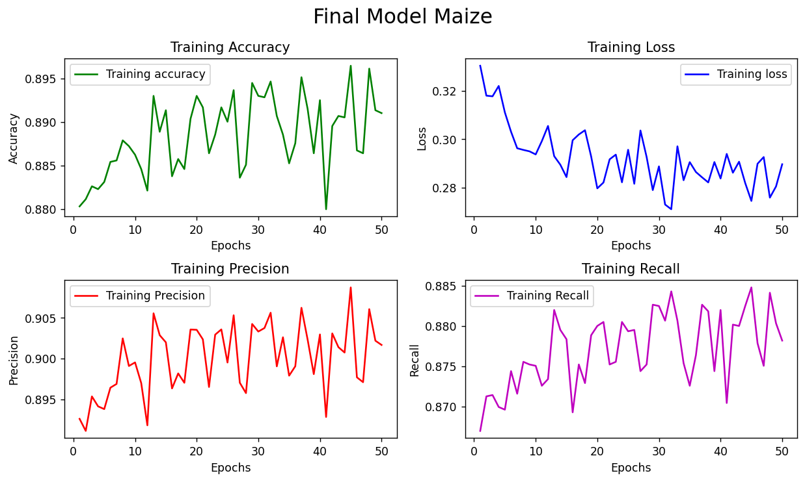

<table>
<tr><td>Metrics</td><td>Training Average</td></tr>   
<tr><td>Loss</td><td>28%</td></tr>
<tr><td>Accuracy</td><td>89.3%</td></tr>
<tr><td>Precision</td><td>90.3%</td></tr>
<tr><td>Recall</td><td>87.6.5%</td></tr>
<tr><td>F1 Score</td><td>88.9%</td></tr> 
</table>

---

# Conclusion
In conclusion it is fair to say that these image classifier models can be used to detect the diseases in Banana and Maize crops. The models have been trained on a limited dataset and have shown good performance. The models can be further improved by adding more data, more training and fine tuning the hyperparameters. The models can be used to detect the diseases in the early stages and provide recommendations to the farmers. This can help in reducing the impact of the diseases and improve the yield and quality of the crops.

# Recommendations, Next Steps and Future Work
1. Train the models on a larger dataset especially for the diseases with low severity infection levels in both Banana and Maize crops
2. Fine tune the hyperparameters of the models to improve the performance
3. Train the models on other crops like Tomato, Potato, Cucumbers, Melons, etc. to build a multi-crop disease detection Model
4. Build a Test application for testing the models
5. Deploy the models on the cloud for real-time disease detection
6. Integrate the models with other tools like drones, IoT devices, etc. for better disease detection and management in the fields

## Positive Effect of Fighting Crop Loss
Currently world over, the crop loss is estimated to be `25%-30 annually`. If effective steps are taken to combat this crop loss, we can address many of the societal problems like:
1. Food security
2. Infant and adult malnutrition
3. Skyrocketing inflation
4. Large-scale social disturbances
and more...

#### Banana:
Major diseases affecting the wonderful fruit of Banana (other than the two considered in the project) globally are:
1. **Banana Bunchy Top Virus**: This is serious virus that is major threat to Banana Plantations worldwide. If left unattended to, with in few seasons (starting with 70%-90% in first season), it results in nearly `100%` crop loss.
2. **Yellow Sigatoka**: This fungal disease causes the younger leaves to prematurely die, smaller bananas, yield losses (about`50%`) and eventual death of the plant.
3. **Moko Disease**: This bacterial wilt disease, usually transmitted by insects, rain and irrigation, causes the leaf blades to turn yellow, premature fruit ripening, fruit discoloration and eventually turning black.

#### Maize
Major Crop Diseases affecting Maize Crop (other than 2 considered for the project) are:
1. Gray Leaf Spot: This is number 1 disease in all corn production. It manifests as gray to tan, rectangular lesions on leaves, sheaths, and husks, and can lead to significant yield reduction. 
2. Fusarium Ear Rot : This cause major problems worldwide with reducing yield, grain quality and causes health issues in humans and livestock with `Mycotoxin Production`
3. Charcoal Rot : This fungal disease thrives in hot and humid conditions (South Asia, Africa and South America) causes premature-maturity, reduced root strength and plant death affecting overall crop yield
4. Tar Rust: A relatively new and emerging disease in the United States, tar spot is caused by the fungus Phyllachora maydis and is characterized by small, raised black spots that resemble fisheyes on both sides of leaves. It can lead to leaf deterioration, poor grain fill, and yield losses

Even, if the crop losses are reduced by `10%` or `20%` globally, the Gross Production Value generated by the crop producing countries will save substantial amounts of money. We are talking about **Billions of US$** that can be put to better use.

#### Banana Gross Production Value Recovery Potential:
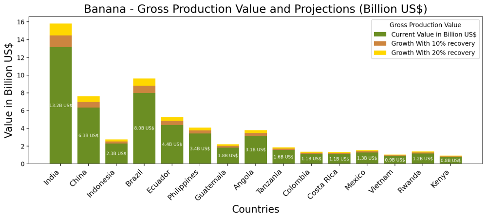

#### Maize Gross Production Value Recovery Potential:
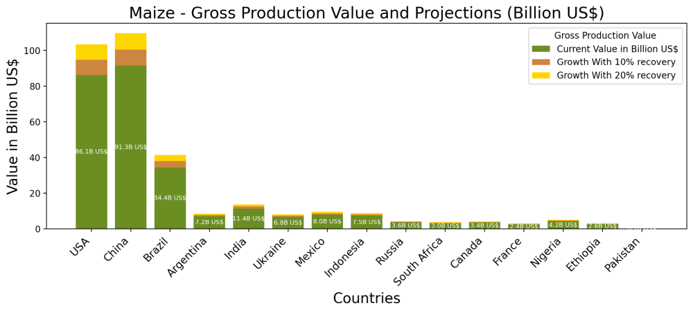

---
Link to Project Jupiter Notebooks:
1. [Exploratory Data Analysis Jupyter Notebook](https://github.com/Shashidhar-Sathya/crop_diseases_capstone/blob/main/01_crop_diseases_EDA.ipynb)
2. [Modeling Jupyter Notebook](https://github.com/Shashidhar-Sathya/crop_diseases_capstone/blob/main/02_crop_disease_modeling.ipynb)
3. [Fully Trained Model Jupyter Notebook](https://github.com/Shashidhar-Sathya/crop_diseases_capstone/blob/main/03_crop_disease_final_models.ipynb)

--- 

#### References

- *USDA NIFA https://www.nifa.usda.gov/about-nifa/blogs/researchers-helping-protect-crops-pests*
- *World Food Programme : https://www.wfp.org/global-hunger-crisis*
- *Center for Strategic & International Studies: https://www.csis.org/analysis/dangerously-hungry-link-between-food-insecurity-and-conflict*
- *Uncontained spread of Fusarium wilt of banana threatens African food security
https://journals.plos.org/plospathogens/article?id=10.1371/journal.ppat.1010769*
- *Maize Streak Virus
https://www.sciencedirect.com/science/article/abs/pii/B978012374410400707X*
- *https://www.sciencedirect.com*
- *https://www.faostat.com*
- *https://cahfsa.org/*
- *https://iimr.icar.gov.in/?page_id=2134 Indian Council for Agricultural Research*
- *https://apsjournals.apsnet.org/doi/10.1094/PHP-05-20-0038-RS*
- *https://www.cropscience.bayer.us/articles/bayer/general-leaf-diseases-of-corn*

---
You can reach me via&nbsp;&nbsp;<a href="https://www.linkedin.com/in/shashidharsathya" a>
&nbsp;&nbsp;
https://www.linkedin.com/in/shashidharsathya
 </a>
